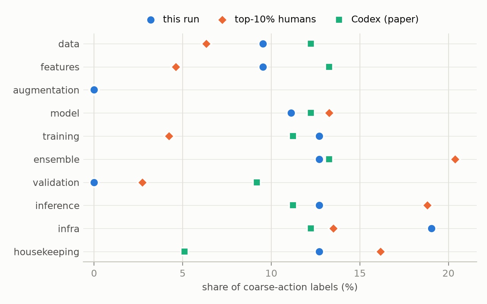
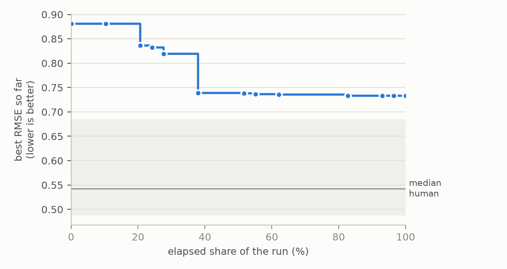

# Trajectory behavior report: run_20260801_190617_haiku45_rec_1h_commonlitreadabilityprize

- harness: **claude-code** · competition: **commonlitreadabilityprize** (RMSE, lower is better; paired reference: this competition's own human and agent trajectories)
- versions: **13** distinct code states from **14** grader calls · scored: 13
- best score: **0.73304** → better than **20.4%** of the 103 human trajectories on this competition (each human counted at their best score)

## Behavioral fingerprint

Share of coarse-action labels (%):

| action | this run | top10 | codex |
|---|---|---|---|
| data | 9.5 | 6.3 | 12.2 |
| features | 9.5 | 4.6 | 13.3 |
| augmentation | 0.0 | 0.0 | 0.0 |
| model | 11.1 | 13.3 | 12.2 |
| training | 12.7 | 4.2 | 11.2 |
| ensemble | 12.7 | 20.4 | 13.3 |
| validation | 0.0 | 2.7 | 9.2 |
| inference | 12.7 | 18.8 | 11.2 |
| infra | 19.1 | 13.5 | 12.2 |
| housekeeping | 12.7 | 16.2 | 5.1 |

Jensen-Shannon divergence (bits) between this run's action distribution and each reference cohort, nearest first:

| cohort | JSD |
|---|---|
| top10 | 0.0548 |
| mlev_normal | 0.0568 |
| top10-40 | 0.0615 |
| top40-70 | 0.0639 |
| codex | 0.0677 |
| top70-100 | 0.0902 |
| mlev_best | 0.1118 |

Primary-intent shares over 12 labeled transitions:

| intent | this run | top10 | codex |
|---|---|---|---|
| exploration | 0.083 | 0.089 | 0.118 |
| optimization | 0.917 | 0.708 | 0.824 |
| pivoting | 0.000 | 0.000 | 0.000 |
| debugging | 0.000 | 0.117 | 0.059 |
| restructuring | 0.000 | 0.028 | 0.000 |
| verification | 0.000 | 0.058 | 0.000 |

## Score progress

The line is this run's best score so far. The shaded band is the middle half of the human trajectories on this competition, each at its best score.

## Memory profile

- grader calls: **14**
- distinct code states: **13**
- redundancy (share of grader calls on an unchanged code state): **0.0714**
- agent sessions (from native_session.log): **12**
- code states per session: **1.08**

---
*Generated 2026-09-23 22:03 by traceml-toolkit 0.1.0. Labels: released Qwen3-1.7B TraceML labelers. Reference: TraceML paired split (jerryyan/TraceML@9a3c790).*
