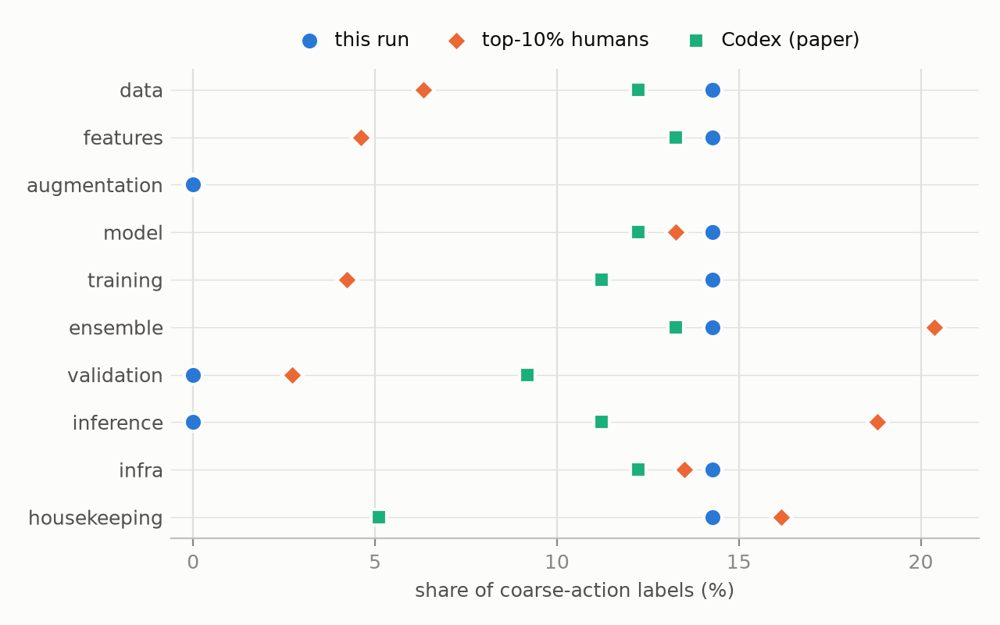
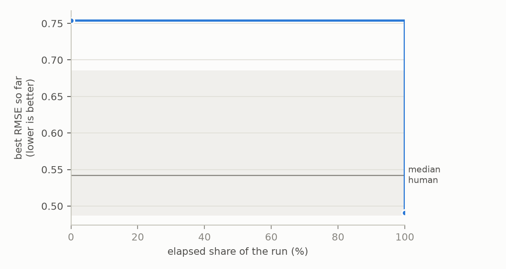

# Trajectory behavior report: run_20260801_203455_flash25_rec_1h_commonlitreadabilityprize

- harness: **gemini-cli** · competition: **commonlitreadabilityprize** (RMSE, lower is better; paired reference: this competition's own human and agent trajectories)
- versions: **2** distinct code states from **3** grader calls · scored: 2
- best score: **0.49086** → better than **72.8%** of the 103 human trajectories on this competition (each human counted at their best score)

## Behavioral fingerprint

Share of coarse-action labels (%):

| action | this run | top10 | codex |
|---|---|---|---|
| data | 14.3 | 6.3 | 12.2 |
| features | 14.3 | 4.6 | 13.3 |
| augmentation | 0.0 | 0.0 | 0.0 |
| model | 14.3 | 13.3 | 12.2 |
| training | 14.3 | 4.2 | 11.2 |
| ensemble | 14.3 | 20.4 | 13.3 |
| validation | 0.0 | 2.7 | 9.2 |
| inference | 0.0 | 18.8 | 11.2 |
| infra | 14.3 | 13.5 | 12.2 |
| housekeeping | 14.3 | 16.2 | 5.1 |

Jensen-Shannon divergence (bits) between this run's action distribution and each reference cohort, nearest first:

| cohort | JSD |
|---|---|
| top40-70 | 0.1011 |
| mlev_normal | 0.1085 |
| top10-40 | 0.1141 |
| codex | 0.1217 |
| top70-100 | 0.1354 |
| mlev_best | 0.1633 |
| top10 | 0.1633 |

Primary-intent shares over 1 labeled transitions:

| intent | this run | top10 | codex |
|---|---|---|---|
| exploration | 1.000 | 0.089 | 0.118 |
| optimization | 0.000 | 0.708 | 0.824 |
| pivoting | 0.000 | 0.000 | 0.000 |
| debugging | 0.000 | 0.117 | 0.059 |
| restructuring | 0.000 | 0.028 | 0.000 |
| verification | 0.000 | 0.058 | 0.000 |

## Score progress

The line is this run's best score so far. The shaded band is the middle half of the human trajectories on this competition, each at its best score.

## Memory profile

- grader calls: **3**
- distinct code states: **2**
- redundancy (share of grader calls on an unchanged code state): **0.3333**
- agent sessions (from native_session.log): **3**
- code states per session: **0.67**

---
*Generated 2026-09-23 22:03 by traceml-toolkit 0.1.0. Labels: released Qwen3-1.7B TraceML labelers. Reference: TraceML paired split (jerryyan/TraceML@9a3c790).*
